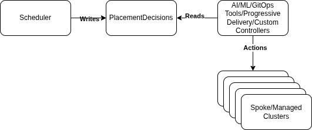

# KEP-5313: PlacementDecision API

<!-- toc -->
- [Release Signoff Checklist](#release-signoff-checklist)
- [Summary](#summary)
- [Motivation](#motivation)
  - [Goals](#goals)
  - [Non-Goals](#non-goals)
- [Proposal](#proposal)
  - [User Stories (Optional)](#user-stories-optional)
    - [Story 1: GPU-aware AI training](#story-1-gpu-aware-ai-training)
    - [Story 2: Progressive rollout](#story-2-progressive-rollout)
    - [Story 3: Disaster recovery](#story-3-disaster-recovery)
  - [Notes/Constraints/Caveats (Optional)](#notesconstraintscaveats-optional)
  - [Risks and Mitigations](#risks-and-mitigations)
- [Design Details](#design-details)
  - [Test Plan](#test-plan)
      - [Prerequisite testing updates](#prerequisite-testing-updates)
      - [Unit tests](#unit-tests)
      - [Integration tests](#integration-tests)
      - [e2e tests](#e2e-tests)
  - [Graduation Criteria](#graduation-criteria)
  - [Upgrade / Downgrade Strategy](#upgrade--downgrade-strategy)
  - [Version Skew Strategy](#version-skew-strategy)
- [Production Readiness Review Questionnaire](#production-readiness-review-questionnaire)
  - [Feature Enablement and Rollback](#feature-enablement-and-rollback)
  - [Rollout, Upgrade and Rollback Planning](#rollout-upgrade-and-rollback-planning)
  - [Monitoring Requirements](#monitoring-requirements)
  - [Dependencies](#dependencies)
  - [Scalability](#scalability)
  - [Troubleshooting](#troubleshooting)
- [Implementation History](#implementation-history)
- [Drawbacks](#drawbacks)
- [Alternatives](#alternatives)
- [Infrastructure Needed (Optional)](#infrastructure-needed-optional)
<!-- /toc -->

## Release Signoff Checklist

Items marked with (R) are required *prior to targeting to a milestone / release*.

- [ ] (R) Enhancement issue in release milestone, which links to KEP dir in [kubernetes/enhancements] (not the initial KEP PR)
- [ ] (R) KEP approvers have approved the KEP status as `implementable`
- [ ] (R) Design details are appropriately documented
- [ ] (R) Test plan is in place, giving consideration to SIG Architecture and SIG Testing input (including test refactors)
  - [ ] e2e Tests for all Beta API Operations (endpoints)
  - [ ] (R) Ensure GA e2e tests meet requirements for [Conformance Tests](https://github.com/kubernetes/community/blob/master/contributors/devel/sig-architecture/conformance-tests.md) 
  - [ ] (R) Minimum Two Week Window for GA e2e tests to prove flake free
- [ ] (R) Graduation criteria is in place
  - [ ] (R) [all GA Endpoints](https://github.com/kubernetes/community/pull/1806) must be hit by [Conformance Tests](https://github.com/kubernetes/community/blob/master/contributors/devel/sig-architecture/conformance-tests.md) 
- [ ] (R) Production readiness review completed
- [ ] (R) Production readiness review approved
- [ ] "Implementation History" section is up-to-date for milestone
- [ ] User-facing documentation has been created in [kubernetes/website], for publication to [kubernetes.io]
- [ ] Supporting documentation—e.g., additional design documents, links to mailing list discussions/SIG meetings, relevant PRs/issues, release notes

[kubernetes.io]: https://kubernetes.io/
[kubernetes/enhancements]: https://git.k8s.io/enhancements
[kubernetes/kubernetes]: https://git.k8s.io/kubernetes
[kubernetes/website]: https://git.k8s.io/website

## Summary

Today every multicluster scheduler publishes its own API to convey where a workload should run,
forcing downstream tools such as GitOps engine, workload orchestrator, progressive rollout controller,
or AI/ML pipeline having to understand a scheduler specific API.

This KEP introduces a vendor neutral `PlacementDecision` API that standardizes
the output of multicluster placement calculations.  
A `PlacementDecision` object is data only: a namespaced list of chosen clusters
whose `clusterName` values must map one to one to `ClusterProfile` names defined by the
[ClusterProfile API](https://github.com/kubernetes/enhancements/pull/4322).
Any scheduler can emit the object and any consumer can watch it.
Neither side needs to know about the other, enabling true plug and play in the multicluster stack.




## Motivation

A typical multicluster setup:

1. Scheduler: examines the fleet (`ClusterProfile` objects) and decides *where* a workload should land.
2. Consumer: GitOps engine, workload orchestrator, progressive rollout controller, AI/ML pipeline
   read that decision and act (usually by creating [Work](https://github.com/kubernetes-sigs/work-api) objects).

Currently every scheduler have its own API for step #1
so each consumer might need to learn different APIs which slow down integration,
locking users to specific vendors, and complicate RBAC/validation work.

A standardize unversial `PlacementDecision` API:

* Decouples schedulers from consumers swap either side without rewriting the other.
* Aligns with the SIG-Multicluster `ClusterProfile` inventory:
  the decision's cluster keys are guaranteed to exist.
* Simplifies RBAC: one resource and label schema to secure.
* Enables GPU aware AI scheduling, cost based placement, and rapid failover.

### Goals

* Define a namespaced scope, minimalistic, data only `PlacementDecision` API that lists selected clusters.
* Support continuous rescheduling: decision list may be updated.
* Guarantee that every `clusterName` entry matches a `ClusterProfile.metadata.name` in the same inventory.
* Guarantee that every `clusterName` entry is in the same namespace as `PlacementDecision.metadata.namespace`.
* Provide label conventions so consumers can retrieve all slices of one placement.
* Leave room for schedulers implementations.

### Non-Goals

* Describing how a scheduler made its choice (Placement API spec).
* Describing how consumers access selected clusters.
* Embedding orchestration logic or consumer feedback in `PlacementDecision`.
* Replace/overlap Work API which is responsible for actually applying the workload.

## Proposal

### API Definition

```
// PlacementDecision publishes the selected clusters for one Placement.
type PlacementDecision struct {
  metav1.TypeMeta   `json:",inline"`
  metav1.ObjectMeta `json:"metadata,omitempty"`

  // Up to 100 ClusterDecisions per object (slice) to stay well below the etcd limit.
  Decisions []ClusterDecision `json:"decisions"`
}

// Label that links all slices to their originating Placement request.
const PlacementLabel = "multicluster.x-k8s.io/placement"

// Label that link all slices to which scheduler produced the slices.
const SchedulerLabel = "multicluster.x-k8s.io/scheduler"

type ClusterDecision struct {
  // MUST match a ClusterProfile.metadata.name in the same namespace.
  ClusterName string `json:"clusterName"`
}
```

### API Example

```
apiVersion: multicluster.x-k8s.io/v1alpha1
kind: PlacementDecision
metadata:
  name: app-placement-decision-1
  namespace: argocd
  labels:
	  multicluster.x-k8s.io/placement: app-placement
	  multicluster.x-k8s.io/scheduler: multicluster-placement-controller
decisions:
- clusterName: cluster1
- clusterName: cluster2
```

### Terminology

- **Placement**: A scheduler request that asks "where should this workload run?".

- **Scheduler**: Placement controller that writes `PlacementDecisions` based on `ClusterProfiles` and
  scheduling/placement requirements/specs.

- **Consumer**: Any controller (GitOps engine, workload orchestrator, progressive rollout controller, AI/ML pipeline)
  that watches `PlacementDecisions` and acts.

### Slicing

* Following [EndpointSlice](https://kubernetes.io/docs/concepts/services-networking/endpoint-slices/) design,
  a single Placement can fan out to N `PlacementDecision` slices,
  each limited to 100 clusters (`EndpointSlice`'s default).
* All slices for one `Placement` MUST carry the same
  `multicluster.x-k8s.io/placement=<placement-name>` label so consumers can List with a label selector.
* The scheduler that owns the slice MUST label it with
  `multicluster.x-k8s.io/scheduler=<scheduler-name>` for observability.

### Lifecycle
- **Create**: The scheduler creates the slice with the list of clusters in the decisions,
  and sets both labels `multicluster.x-k8s.io/placement=<placement-name>` and
  `multicluster.x-k8s.io/scheduler=<scheduler-name>`.

- **Update / Reschedule**: The scheduler may add or remove clusters in  decisions at any time.
  If the number of target clusters crosses the 100 limit,
  it must create or delete slices to maintain the slicing rule.
  The two required labels should not change and treated as immutable.

- **Delete**: When a placement is no longer required,
  the scheduler deletes every related `PlacementDecision` slice.
  Consumers should react to the delete event and remove any workload previously applied to the listed clusters.

### Relationship to other SIG-Multicluster (SIG-MC) APIs
* **ClusterProfile** The inventory. Each decision must reference a matching name `ClusterProfile`
* **Work API** The workload. A consumer may read `PlacementDecision` then for each cluster creates `Work`.

### User Stories (Optional)

#### Story 1: GPU-aware AI training

* ML scheduler scores every `ClusterProfile` by available GPUs, cost, etc.  
* Scheduler writes `PlacementDecision` listing the best clusters.
* A GitOps/Work-API syncer watches the decision and deploys the training job only to the listed clusters.
* If cost rises or GPUs becoming unavailable, the scheduler updates `PlacementDecision` with new list,
  the syncer act accordingly.

#### Story 2: Progressive rollout

* A progressive rollout controller begins with some canary clusters.  
* It creates `PlacementDecision` containing just those clusters.  
* Gradually updates `PlacementDecision` based on health and then eventually all clusters.  
* Consumers watch and deploy only where the decision says.  

#### Story 3: Disaster recovery

* A DR controller monitors `ClusterProfiles` status.
* Controller updates the corresponding `PlacementDecision`,
  replacing primary cluster with standby cluster.
* Syncer deletes workloads from the failed cluster and recreates them in the standby cluster.

### Notes/Constraints/Caveats (Optional)

### Risks and Mitigations

## Design Details

* Scope: Namespace scoped for RBAC parity with Work and ClusterProfile.

* The resource is pure data following `EndpointSlice` convention.

* Max size: 100 ClusterDecision entries per slice keeps object well below etcd limit.

* Validation: A webhook may verify that every clusterName exists
as a ClusterProfile in the same inventory/namespace. The labels
`multicluster.x-k8s.io/placement=<placement-name>` and
`multicluster.x-k8s.io/scheduler=<scheduler-name>` are populated and immutable.

### Test Plan

[x] I/we understand the owners of the involved components may require updates to
existing tests to make this code solid enough prior to committing the changes necessary
to implement this enhancement.

* Unit tests for CRD defaults/validation.

* Ensuring slice size <= 100 and required labels exists.

* Integration tests: fake scheduler writes decisions and fake consumer verifies watches.
  Scale test with large number of clusters and placements.

##### Prerequisite testing updates

<!--
Based on reviewers feedback describe what additional tests need to be added prior
implementing this enhancement to ensure the enhancements have also solid foundations.
-->

##### Unit tests

- `<package>`: `<date>` - `<test coverage>`

##### Integration tests

- <test>: <link to test coverage>

##### e2e tests

- <test>: <link to test coverage>

### Graduation Criteria

#### Alpha

- A CRD definition and generated client.
- A dummy controller and unit test to validate the CRD and client.

#### Beta

- Gather feedback from users during the Alpha stage to identify any
  issues, limitations, or areas for improvement. Address this feedback
  by making the necessary changes to the API and iterating on its design
  and functionality.
- At least two providers and one consumer using `PlacementDecision` API.
- Conformance test suite for schedulers.
- Metrics for slice count and QPS.
- Backwards compatible field/label stability.

#### GA

- N examples of real-world usage
- N installs
- More rigorous forms of testing ie. downgrade tests and scalability
  tests
- Allowing time for feedback
- Stability: The API should demonstrate stability in terms of its
  reliability.
- Functionality: The API should provide the necessary functionality for
  multicluster scheduling, including the ability to distribute workloads
  across clusters. This should be validated through a series of
  functional tests and real-world use cases.
- Integration: Ensure that the API can be easily integrated with popular
  workload distribution tools, such as GitOps and Work API. This may
  involve developing plugins or extensions for these tools or providing
  clear guidelines on how to integrate them with the unified API.
- Performance and Scalability: Conduct performance and scalability tests
  to ensure that the API can handle a large number of clusters and
  workloads without degrading its performance. This may involve stress
  testing the API with a high volume of requests or simulating
  large-scale deployments.

**Note:** Generally we also wait at least two releases between beta and
GA/stable, because there's no opportunity for user feedback, or even bug
reports, in back-to-back releases.

### Upgrade / Downgrade Strategy

### Version Skew Strategy

## Production Readiness Review Questionnaire

### Feature Enablement and Rollback

###### How can this feature be enabled / disabled in a live cluster?

- [ ] Feature gate (also fill in values in `kep.yaml`)
  - Feature gate name:
  - Components depending on the feature gate:
- [x] Other
  - Describe the mechanism:
  - Will enabling / disabling the feature require downtime of the control
    plane?
  - Will enabling / disabling the feature require downtime or reprovisioning
    of a node?

###### Does enabling the feature change any default behavior?

- No default Kubernetes behavior is currently planned to be based on
  this feature; it is designed to be used by the separately installed,
  out-of-tree, multicluster management providers and consumers.

###### Can the feature be disabled once it has been enabled (i.e. can we roll back the enablement)?

- Yes, as this feature only describes a CRD, it can most directly be
  disabled by uninstalling the CRD.

###### What happens if we reenable the feature if it was previously rolled back?

###### Are there any tests for feature enablement/disablement?

- As a dependency only for an out-of-tree component, there will not be
  e2e tests for feature enablement/disablement of this CRD in core
  Kubernetes. The e2e test can be provided by multicluster management
  providers who support this API.

### Rollout, Upgrade and Rollback Planning

###### How can a rollout or rollback fail? Can it impact already running workloads?

###### What specific metrics should inform a rollback?

###### Were upgrade and rollback tested? Was the upgrade->downgrade->upgrade path tested?

###### Is the rollout accompanied by any deprecations and/or removals of features, APIs, fields of API types, flags, etc.?

### Monitoring Requirements

###### How can an operator determine if the feature is in use by workloads?

###### How can someone using this feature know that it is working for their instance?

- [x] Events
  - Event Reason: 
- [ ] API .status
  - Condition name: 
  - Other field: 
- [ ] Other (treat as last resort)
  - Details:

###### What are the reasonable SLOs (Service Level Objectives) for the enhancement?

###### What are the SLIs (Service Level Indicators) an operator can use to determine the health of the service?

- [ ] Metrics
  - Metric name:
  - [Optional] Aggregation method:
  - Components exposing the metric:
- [ ] Other (treat as last resort)
  - Details:

###### Are there any missing metrics that would be useful to have to improve observability of this feature?

### Dependencies


###### Does this feature depend on any specific services running in the cluster?

### Scalability

###### Will enabling / using this feature result in any new API calls?

###### Will enabling / using this feature result in introducing new API types?

###### Will enabling / using this feature result in any new calls to the cloud provider?

###### Will enabling / using this feature result in increasing size or count of the existing API objects?

###### Will enabling / using this feature result in increasing time taken by any operations covered by existing SLIs/SLOs?

###### Will enabling / using this feature result in non-negligible increase of resource usage (CPU, RAM, disk, IO, ...) in any components?

###### Can enabling / using this feature result in resource exhaustion of some node resources (PIDs, sockets, inodes, etc.)?

### Troubleshooting

###### How does this feature react if the API server and/or etcd is unavailable?

###### What are other known failure modes?

###### What steps should be taken if SLOs are not being met to determine the problem?

## Implementation History

## Drawbacks

## Alternatives

- Status quo: every multicluster provider/scheduler ships its own API leads to consumer bloat and vendor lock-in.

- Extending `Work API`: overloads a workload syncner API with scheduling details which couples the where with the what.

## Infrastructure Needed (Optional)
